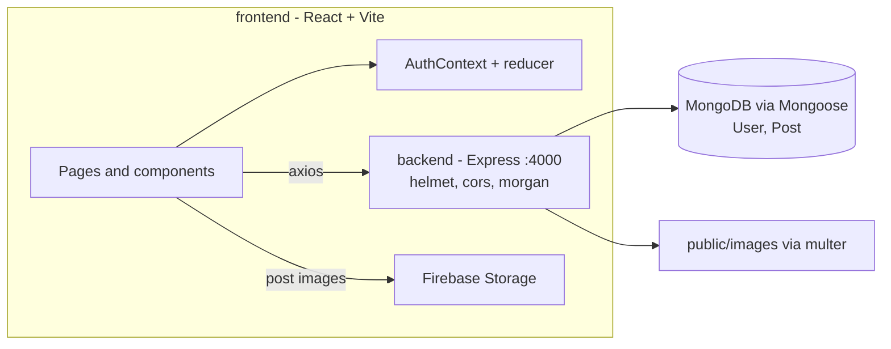

# Social Media MERN

A small social network built with MongoDB, Express, React and Node. Users can register and log in, post text and images, like posts, follow other users, and see a timeline of their own and followed users' posts.

Built while following Lama Dev's "React Node.js Social Media App" MERN tutorial as a learning project. The component names (Topbar, Sidebar, Rightbar, Share, Feed, CloseFriend, Online), the API design and the placeholder users in `frontend/src/dummyData.js` (for example "Safak Kocaoglu") come from that tutorial.

## Status

Learning project, local development only. The frontend calls a hard-coded `http://localhost:4000` backend, and there is no deployment.

## Features (from the code)

**Frontend (`frontend/`)**
- Register, login and forgot-password pages. The logged-in user is kept in React Context with a reducer.
- Home timeline showing your own and followed users' posts. Post times use `timeago.js`.
- Share box for creating posts. Images are uploaded to Firebase Storage and the download URL is saved on the post.
- Like / unlike posts.
- Profile page at `/profile/:username` with that user's posts, a friends list and a follow/unfollow button.

**Backend (`backend/`)**
- Auth with bcrypt-hashed passwords. Login returns the user document; no token or session is issued.
- User update and delete, follow/unfollow, and friend list.
- Post create, update, delete, like toggle, timeline and per-user profile feed.
- `POST /api/upload` saves a file to `backend/public/images` with multer (the current frontend uploads to Firebase instead).

## Architecture



## Tech stack

- **Frontend:** React 18, Vite 5, React Router 6, MUI (components and icons), axios, timeago.js, Firebase (Storage)
- **Backend:** Node.js (ES modules), Express 4, Mongoose 8, bcrypt, multer, helmet, cors, morgan, dotenv

## Getting started

```bash
# backend
cd backend
npm install
cp .env.example .env     # set MONGODB_URI
npm start                # http://localhost:4000

# frontend (in another terminal)
cd frontend
npm install
npm install firebase     # used by utills/config.jsx but missing from package.json
npm run dev
```

## Environment variables

| Location | Name | Purpose |
|----------|------|---------|
| `backend/.env` | `MONGODB_URI` | MongoDB connection string |

The Firebase web config is hard-coded in `frontend/utills/config.jsx`.

## API reference

There is no auth middleware. Ownership checks compare `userId` sent in the request body.

| Method | Path | Purpose |
|--------|------|---------|
| POST | `/api/auth/register` | Create a user |
| POST | `/api/auth/login` | Check credentials and return the user |
| POST | `/api/auth/forgot-password` | Set a new password for an email |
| GET | `/api/users?userId=` or `?username=` | Get a user (password omitted) |
| PUT | `/api/users/:id` | Update own account (`userId` in body, or `isAdmin`) |
| DELETE | `/api/users/:id` | Delete own account |
| PUT | `/api/users/:id/follow` | Follow a user |
| PUT | `/api/users/:id/unfollow` | Unfollow a user |
| GET | `/api/users/friends/:userId` | List followed users (id, username, picture) |
| POST | `/api/posts` | Create a post |
| PUT | `/api/posts/:id` | Update own post |
| DELETE | `/api/posts/:id` | Delete own post |
| PUT | `/api/posts/:id/like` | Toggle like |
| GET | `/api/posts/:id` | Get a post |
| GET | `/api/posts/timeline/:userId` | Own and followed users' posts |
| GET | `/api/posts/profile/:username` | A user's posts |
| POST | `/api/upload` | Upload a file (multipart `file`) to `public/images` |

## Known limitations

- No JWT or session, so identity is taken from the request body.
- The API URL is hard-coded to localhost.
- `firebase` is missing from `frontend/package.json`.
- No tests.
